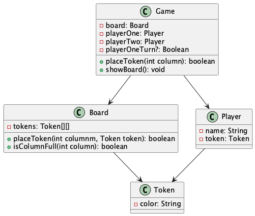

#+title: Ejemplo repo en GIT
#+author: Alaín Chevanier <[[mailto:alain.chevanier@ciencias.unam.mx][alain.chevanier@ciencias.unam.mx]]>

* Ejercicio Modelado y Porgramcion
** Conecta Cuatro
*** Código fuente
Paquete [[file:src/main/java/connect4/][connect4]]

*** Objetivo
- Utilizar GIT y un flujo en github para un problema
- Resolver el problema de Connect Four

*** Descripción del juego
_Connect Four_ es un juego de estrategia para dos jugadores que se juega en un tablero vertical. El objetivo es ser el primero en formar una línea de cuatro fichas consecutivas en cualquier dirección: horizontal, vertical o diagonal.

1. ~Preparación~:
   + El tablero tiene una cuadrícula de 6 filas por 7 columnas.
   + Cada jugador elige un color de ficha (~rojo~ o ~amarillo~).

2. ~Turnos~:
   + Los jugadores se turnan para soltar una ficha de su color en una de las columnas del tablero.
   + La ficha cae hasta la posición más baja disponible en la columna seleccionada.

3. ~Objetivo~:
   + El primer jugador que forme una línea de cuatro fichas consecutivas en cualquier dirección (~horizontal~, ~vertical~ o ~diagonal~) gana la partida.

4. ~Empate~:
   + Si el tablero se llena completamente sin que ningún jugador forme una línea de cuatro, el juego termina en empate.

*** Objetos:
**** Board
**** Token
**** Player
**** Game

*** Diagrama
#+BEGIN_SRC plantuml :file  connect-4-uml-diagram.png :exports results :results file
@startuml
class Board {
        - rows: int
        - columns: int
        - tokens: Token[][]
        + placeToken(int columnm, Token token): void
        + isColumnFull(int column): boolean
        + isFull(): boolean
        + toString(): String
        + getWinner(): Optional<Token>
}
class Token {
        - color: String
}
class Player {
        - name: String
        - token: Token
}
class Game {
        - board: Board
        - players: Player[]
        - currentPlayerTurnIdx: int
        + start(): void
        + placeToken(int column): boolean
        + showBoard(): void
}

Game --> Board
Game --> Player
Board--> Token
Player --> Token
@enduml
#+END_SRC

** String Calculator - Ejemplo TDD
*** Código fuente
Paquete [[file:src/main/java/tdd/][StringCalculator]]
